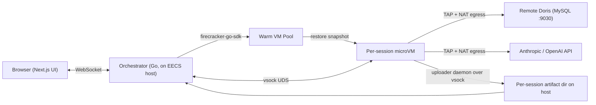

# Firecracker Data Agent Harness — 技术方案

> 这份是项目主计划，后续在不同 session 中按 Phase 推进。
> 凭据等敏感信息见 [`doris-connection.md`](./doris-connection.md)（不要提交到 git）。

## 待办（Phases）

- [ ] **Phase 0**：EECS 环境检查 + Doris/LLM API 联通性验证 + schema markdown 整理
- [ ] **Phase 1**：手工起 rootfs + 单机 Firecracker 跑通 Claude Code 查 Doris 出图的端到端 DEMO
- [ ] **Phase 2**：写 rootfs/snapshot/restore 三件脚本，做到一键烘镜像、一键 restore
- [ ] **Phase 3**：Go 写 Orchestrator MVP：VM 生命周期、warm pool、vsock 多路复用、会话 API
- [ ] **Phase 4**：Next.js 前端 MVP：三栏布局 + WebSocket 流式渲染 thinking/answer/tool-call
- [ ] **Phase 5**：Artifact 体验：in-VM uploader daemon + 右栏实时文件树与预览
- [ ] **Phase 6**：多用户鉴权 + 出站白名单 + 资源限制 + 可观测 + 接入 OpenCode 作为第二 harness

---

## 1. 目标与范围

- **功能**：让用户在网页里跟一个会写 SQL、跑 Python、连 Doris、画图的 AI agent 对话；右侧实时展示产生的文件（CSV / 图表 / Markdown 报告）。
- **隔离**：每个会话 = 一个全新的 Firecracker microVM，从一个预烤好的 snapshot 启动（~200ms），用完即销毁。
- **底座**：单台 EECS Linux 主机（需 KVM）。
- **第一期 Harness**：OpenCode + Claude Code（先 Claude Code 跑通，再加 OpenCode）。Pi 暂不上。
- **数据源**：远端 Apache Doris（MySQL 协议，端口 9030，只读账号 `ro_user_batt`），默认只关注 `vhr_data` 库。

## 2. 整体架构



VM 内运行栈：

- 1 个 init 脚本：读 vsock "bootstrap" 消息拿到 session_id / API keys / Doris 凭据 / 用户问题
- 1 个 agent CLI 进程（Claude Code 或 OpenCode），stdin/stdout 桥接到 vsock 端口 A
- 1 个 uploader daemon：inotify 监听 `/workspace/<session_id>/`，把文件事件 + 内容推到 vsock 端口 B
- 1 个 schema 目录：预烤进 rootfs 的 `vhr_data` 表 schema markdown，agent 当 system context 用

## 3. 关键技术决策

- **VM 内一切自洽**：Agent CLI 在 VM 内直连 Anthropic/OpenAI API，所以 host 不需要任何 LLM 代理逻辑。隔离边界最干净，key 也只在 VM 内出现。
- **通信通道：vsock，不开 SSH**。两条多路复用通道——`port 10000` 跑 agent stdio，`port 10001` 跑 artifact 事件流。Host 侧的 UDS 由 orchestrator 监听。
- **工件同步不用 virtio-fs**（Firecracker 没官方支持）。改成 in-VM uploader daemon → vsock → host 文件落盘。这套也方便给前端推增量事件。
- **网络：per-VM TAP + 严格出站白名单**。iptables 只放行 Doris FE 的 IP:9030 和 LLM API 域名（解析为 IP 集合 + 定期刷新），其余全 drop。防止只读账号被恶意指令外发。
- **每会话注入凭据**，绝不烤进 snapshot：snapshot 是"光秃秃"的；restore 完成后 orchestrator 通过 vsock 发一条 JSON `bootstrap` 消息把 keys / Doris 用户密码 / 用户首条消息塞进去。
- **Warm pool**：保 3–5 个已 restore、卡在等待 bootstrap 的 VM，新会话直接捡一个，用户首字延迟 < 1s。
- **后端语言用 Go**：`firecracker-go-sdk` 成熟，vsock 多路复用、并发管理 VM 生命周期都顺。前端用 Next.js + Tailwind + shadcn/ui。

## 4. 前端布局（仿 Claude.ai 三栏）

- **左**：会话列表（按用户隔离），新建/重命名/删除/归档
- **中**：聊天流。气泡分三类：
  - 用户输入
  - Agent 思考（可折叠的 thinking block，灰色细字）
  - Agent 最终输出（含 inline 代码块、SQL、图片预览）
  - 工具调用事件行（"running SQL…", "writing report.md", "rendering chart.png"）
- **右**：当前会话的 artifact 树
  - 文件系统视图：`/workspace/` 下目录树
  - 文件预览：CSV → 简易表格、PNG → 图、Markdown → 渲染
  - 下载/打包按钮
- **顶**：VM 状态徽标（运行中 / 空闲 / 已停），手动 kill 按钮

## 5. 分阶段实施

> 本机 EECS 当前是个空壳，所以从 0 开始。按从底到顶推进，每一阶段都能独立验证。

### Phase 0 — 环境就绪与可行性确认（半天）

- 在 EECS 上确认 `/dev/kvm` 可访问、`vhost_vsock`、`tun` 模块可加载、`iptables` 可用
- 出站测 Doris 9030 通不通（host: `172.16.0.138`，见 [`doris-connection.md`](./doris-connection.md)）；测 LLM API / harness 能否走本地 Anthropic-compatible proxy
- 拉一份 Doris `vhr_data` 库的 schema，整成 markdown（作为 VM 内置 system context）；连接后始终 `USE vhr_data;`
- 决定每 VM 资源画像（建议起步 1 vCPU / 1 GB RAM）

已完成：

- 本机 Claude Code Proxy 跑通，监听 `0.0.0.0:8082`，Claude Messages endpoint 为 `/v1/messages`。
- Proxy 上游为 OpenAI-compatible API，当前映射模型为 `deepseek-v4-pro`。
- Claude Code `2.1.144` 可通过 `claude --bare -p` 返回 `hi`。
- OpenCode `1.15.5` 可通过 `opencode run` 返回 `hi`。

详见 [`llm-harness-local-test.md`](./llm-harness-local-test.md)。

### Phase 1 — 单 VM 端到端打通（1–2 天）

- 手工建 rootfs（Ubuntu 22.04 minimal 或 Alpine + glibc）：Node.js / Python / `pymysql` / `pandas` / `matplotlib` / Claude Code CLI / uploader daemon 源码
- 手工跑一个 Firecracker，进 VM 用 `pymysql` 连 Doris，默认进入 `vhr_data`，跑一条 SELECT，确认网络与权限
- 在 VM 里手工跑 Claude Code，给它喂 schema + 一句话需求，让它写 SQL、出 CSV、画一张图
- **门禁标准**：能从 Doris 取数 → 写 CSV → 出 PNG → 写 `report.md`

### Phase 2 — Snapshot 流水线（1–2 天）

- 写一个 `build-rootfs.sh`：固定 base image + 安装清单 + agent 二进制 → 输出 `rootfs.ext4`
- 写一个 `bake-snapshot.sh`：冷启 VM → 启动 uploader + agent-stdio-bridge 进入"等 bootstrap"状态 → 暂停 → 出 `vmstate` + `memfile`
- 写 `restore-vm.sh`：从 snapshot 启一个新 VM，分配新 TAP / CID，输出 socket 路径
- **门禁**：脚本化一键造盘 + 一键启盘，restore 实测 < 500 ms

### Phase 3 — Orchestrator MVP（3–5 天，Go）

- `firecracker-go-sdk` 起 VM、配 TAP、配 vsock UDS
- VM 池子管理：min 3 warm / max 30，并发上限 + 资源水位
- 会话生命周期：create / route message / collect artifacts / destroy + 超时回收
- 两个 vsock 通道的多路复用：agent stdio（双向流） + artifact 事件（host 单向收）
- 简陋鉴权：先用 lab 共享密码 + cookie，留 OIDC 接口
- SQLite 记录 sessions / users / artifact 元数据
- **门禁**：curl 创建会话、发消息、收消息、看 artifact 目录全链路通

### Phase 4 — 前端 MVP（3–5 天，Next.js）

- 三栏布局 + WebSocket 流
- 把 thinking / tool-call / answer 三类事件渲染好
- artifact 面板先做"文件名 + 下载"，预览留到 Phase 5
- **门禁**：浏览器里新建会话、问问题、看到流式回答、能下文件

### Phase 5 — Artifact 体验（2–3 天）

- 文件树 + 实时增量更新
- CSV / PNG / MD 内联预览
- 打包下载 zip
- **门禁**：用户问"统计 X 并出图"，看到右侧文件实时出现且能预览

### Phase 6 — 多用户、安全、可观测（持续）

- 出站白名单 iptables 规则跑通（VM 只能到 Doris + LLM API）
- 每 VM 资源 cgroup 限制 + 超时强杀
- Orchestrator metrics（Prometheus）：VM 数、首字延迟、bootstrap 时长
- 接 OpenCode 作为第二个 harness 选项（前端加切换）；本机最小连通性已在 Phase 0 验证，后续重点是 VM bootstrap 和事件协议适配

## 6. 主要风险与缓解

- **网络白名单维护**：LLM API 用域名而非固定 IP，需要 sidecar 定期解析并刷 ipset；起步可先放宽到"只允许 443 + 9030"。
- **API key 管理**：起步可用单一团队 key 注入；后续要做按用户 key 或代理审计层。
- **Doris 查询量**：用户写出失控 SQL 会拖累整个 Doris。对策：在 VM 内的连接器 wrapper 强制 `USE vhr_data;`、`SET query_timeout`、`LIMIT` 提示，host 侧再设 per-session QPS 上限。
- **Snapshot 体积**：rootfs 全套依赖容易上 GB；用 Alpine + 仅安装必要包，保持单 VM <800MB 内存常驻。
- **OpenCode 与 Claude Code 行为差异**：先把抽象层定义成"标准 stdio 协议 + 事件 schema"，两个 harness 各自适配，UI 不感知。

## 7. 仓库结构建议（待 Phase 1 开始时落地）

```
harness-platform/
├── docs/               # 设计文档、运行手册、Doris schema 整理稿
├── orchestrator/       # Go：VM 生命周期、warm pool、vsock 多路复用、会话 API
├── frontend/           # Next.js：三栏 UI
├── vm-image/           # rootfs 构建脚本、init / uploader / stdio-bridge
├── snapshot/           # bake / restore 脚本
├── schema-pack/        # Doris 表 schema markdown（VM 烘进去给 agent 当 context）
└── infra/              # iptables、systemd unit、运行手册
```

## 8. 可行性结论

- **架构层面可行**。Firecracker + vsock + 远端 Doris 这条链路是成熟组合（Fly.io、AWS Lambda 都这么用）。
- **单机容量足够**。如果只是同事内测（同时 5–20 人），单台 EECS 主机 16 核 / 32 GB 起就够，瓶颈大概率是 Doris 端而非 VM。
- **首字延迟可达标**。warm pool 命中时 < 1s，冷池 < 2s。
- **最大的工程量在 orchestrator 的 vsock 多路复用 + 前端 artifact 实时同步**，建议 Phase 3/5 多预留 buffer。

下一步从 **Phase 0**（环境检测脚本 + Doris 连通性 + schema 整理）开始。
